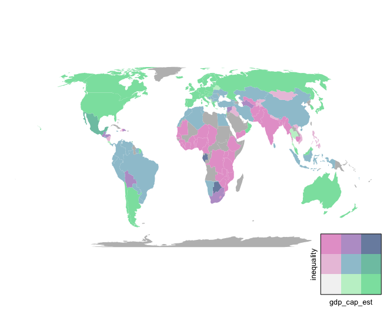

# Bivariate tmap

The *bivariate_tmap.R* script defines a simple function named *bivariate_choropleth* which uses the [*tmap*](https://cran.r-project.org/web/packages/tmap/) library to create a bivariate choropleth map (using a color scheme fro [Joshua Stevens's fantastic blog post](http://www.joshuastevens.net/cartography/make-a-bivariate-choropleth-map/)) and plot it including a legend created using the [grid](https://stat.ethz.ch/R-manual/R-devel/library/grid/html/Grid.html) library.  

The *bivariate_choropleth* function parameters are:

* *bivmap_dataset*, a SpatialPoligonDataFrame;
* *bivmap_vars*, a vector of characters containing the name of the two variables;
* *bivmap_labels*, a vector of characters containing the labels for the two variables, to use in the legend (default is *NA*, in; which case, values from *bivmap_vars* are used);
* *bivmap_style*, classification type for the bins (default is *'quantile'*);
* *bivmap_scale*, whether to use a scale bar (default is *FALSE*).

The *bivariate_choropleth* function uses a function named *get_bivariate_choropleth* which simply creates the map (without the legend) and returns the related object. This function can also be used directly for further manipulation of the map.

## Requirements

The function was developed using R version 3.5.1, and it requires the following R libraries:

* [sp](https://cran.r-project.org/web/packages/sp/)
* [spdep](https://cran.r-project.org/web/packages/spdep/)
* [tmap](https://cran.r-project.org/web/packages/tmap/)
* [classInt](https://cran.r-project.org/web/packages/classInt/)
* [grid](https://stat.ethz.ch/R-manual/R-devel/library/grid/html/Grid.html)
* [gridExtra](https://cran.r-project.org/web/packages/gridExtra/)
* [lattice](https://cran.r-project.org/web/packages/lattice/)

## Example

Example script.

```r
# Import function
source("bivariate_tmap.R")

# Import example data
library(tmap)
data("World")
# Transform data to SpatialPolygonDataFrame
library(sf)
world_spdf <- as(World, "Spatial")

# Plot bivariate choroplet map
bivariate_choropleth(world_spdf, c("gdp_cap_est", "inequality"))
```

Console output (categories).

```
gdp_cap_est breaks (x-axis):
style: quantile
[300.4693,3356.704) [3356.704,13587.93)    [13587.93,2e+05] 
                 59                  58                  59 
inequality breaks (y-axis):
style: quantile
  one of 9,045 possible partitions of this variable into 3 classes
[0.0432207,0.1672642) [0.1672642,0.2736572) [0.2736572,0.5073423] 
                   45                    45                    46 
```

Output map.



## Acknowledments
I would like to acknowledge the contribution by [Andrea Ballatore](https://twitter.com/a_ballatore), who collaborated on the [paper](https://link.springer.com/chapter/10.1007/978-3-319-78208-9_8) for which I originally wrote this script, helped me testing it, and encouraged me to publish it.